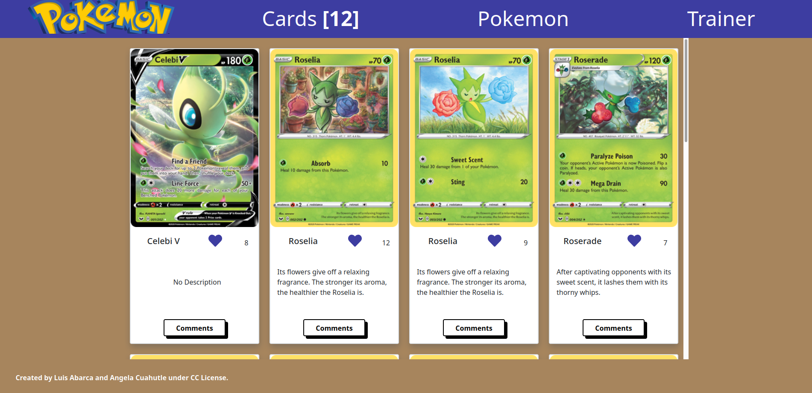

# CapstoneJS-API-Webapp
This is a project that involves the creation of a Webapp consumming an API

# CapstoneJS-API-Webapp

> This is a project that involves the creation of a Webapp consumming two APIs services.

 

Additional description about the project and its features.

## Built With

- HTML5
- CSS3
- JavaScript
- Bootstrap
- Linters
- API: Pokemon TCG
- API: Involvement Microverse

If you like, you can see a live demo of the site here:

[Live Demo Link](https://theluisabarca.github.io/CapstoneJS-API-Webapp/dist/)

## Getting Started

To get a local copy up and running follow these simple example steps:

- Select the link with the code on the https code tab in the repo.
- Open a Terminal and write the command: 
> `git clone https://github.com/angelacuahutle/CapstoneJS-API-Webapp`.
- Drag the index.html to any browser.

## Test

- After cloning the project you need to run these commands

  > `npm install`
  > This command will download all the dependancies of the project

As this project counts with html, css and javascript, you will need to test the following:

- For tracking linter errors in HTML files run:

  > `npx hint .`

- For tracking linter errors in CSS or SASS  files run:

  > `npx stylelint "\*_/_.{css,scss}"`

- And for tracking linter errors in JavaScript files run:

  > `npx eslint .`

### Deployment

## Authors

👤 **Angela Cuahutle**
- GitHub: [@angelacuahutle](https://angelacuahutle/CapstoneJS-API-Webapp)

👤 **Luis Abarca**

- GitHub: [@TheLuisAbarca](https://github.com/TheLuisAbarca)

## 🤝 Contributing

Contributions, issues, and feature requests are welcome!

Feel free to check the [issues page](../../issues/).

## Show your support

Give a ⭐️ if you like this project!

## Acknowledgments

- Hat tip to anyone whose code was used
- Inspiration
- etc

## 📝 License

This project is [MIT](./MIT.md) licensed.
